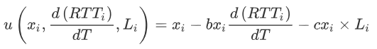
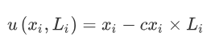

## PCC-Vivace

**P**erformance-oriented **C**ongestion **C**ontrol

This is the code for Computer Networks course project in 2018 Fall to implement [PCC-Vivace](https://www.usenix.org/system/files/conference/nsdi18/nsdi18-dong.pdf) as a Linux kernel module, maintained by [Han Xue](https://github.com/xiaoxiaoxh), [Yifan Zhang](https://github.com/YiF-Zhang), [Kaiwen Zha](https://github.com/KaiwenZha) and [Qibing Ren](https://github.com/renqibing).

## Using PCC

### Environment

This module was tested and developed on Ubuntu: `16.04 x64`

```
Linux version 4.15.0-43-generic (gcc version 5.4.0)
```

Check kernel version with: `uname -r`

Current kernel sources are located at `/lib/modules/$(uname -r)/build`

Load `bbr` for sanity: `sudo modprobe tcp_bbr`

### Compilation

We implemented two kernel modules of PCC: `PCC-Kernel-Vivace-Latency` and `PCC-Kernel-Vivace-Loss`. They have the same compilation steps. 

Compile the kernel module and install it:

```bash
cd PCC_PATH/src
make
sudo insmod tcp_pcc.ko
```

### Usage

Now you can use `pcc` as a congestion control algorithm:

```python
import socket

TCP_CONGESTION = getattr(socket, 'TCP_CONGESTION', 13)

s = socket.socket()
s.setsockopt(socket.IPPROTO_TCP, TCP_CONGESTION, 'pcc')

# Use socket s
```

You can also use our provided scripts `client.py` and `server.py` for testing.

- Start the **multi-thread server** process:

```python
python server.py [-h] [-ip IP] [-bs BUFFER_SIZE] [-p {cubic,pcc,bbr}] 
```

The server will wait for connections from possible clients, and start a new thread to handle messages for every connection. 

Note that you can assign IP address, buffer size and congestion control protocol with these parameters.

- Start the **multi-thread client** process:

```python
python client.py [-h] [-ip IP] [-l LENGTH] [-bs BUFFER_SIZE] [-p {cubic,pcc,bbr}] [-th THREAD_NUM]
```

The client will make a certain number of connections with the server by creating multiple sockets.

Note that you can assign IP address, length of sending messages, buffer size, congestion control protocol and number of threads with these parameters.

## Implementation details

### Code

- We implemented two PCC-Vivace kernel modules, which are `PCC-Kernel-Vivace-Latency` and `PCC-Kernel-Vivace-Loss`. All PCC code resides under `PCC_PATH/src/tcp_pcc.c`.  
- We also provide testing scripts `client.py` and `server.py`. 
- The visualization code `plot.py`and experimental data are in folder `Visualization & Data`.  

### Congestion Hooks

The Linux kernel allows creating "modular" CAs.

This is achieved by a set of hooks which must or can be implemented by the CA module.

For the complete set of hooks - see `struct tcp_congestion_ops` definition in the Linux kernel.

PCC uses the main hook `cong_control` introduced by BBR.

The hook has two purposes with regard to the current PCC implementation:

- A periodic hook which is called on each ack - allowing us to "slice" intervals.
- A hook, that on each ack, reports "acks" and "losses" of sent packets - allowing us to accumulate statistics for "Monitor Intervals" (MIs) and eventually calculate utility.

The entire PCC logic resides in the following hooks:

```c
static struct tcp_congestion_ops tcp_pcc_cong_ops __read_mostly = {
	.flags = TCP_CONG_NON_RESTRICTED,
	.name = "pcc",
	.owner = THIS_MODULE,
	.init = pcc_init,
	.release = pcc_release,
	.cong_control = pcc_process_sample, // congestion control hook
	.undo_cwnd = pcc_undo_cwnd, 
	.ssthresh = pcc_ssthresh,
	.set_state	= pcc_set_state,
	.cong_avoid = pcc_cong_avoid,
	.pkts_acked = pcc_pkts_acked,
	.in_ack_event = pcc_ack_event,
	.cwnd_event	= pcc_cwnd_event,
};
```

### Utility calculation

We use two different utility functions for `PCC-Vivace-Latency` and `PCC-Vivace-Loss`. 

- PCC-Vivace-Latency



Here we set `b` as 900 and `c` as 11.

- PCC-Vivace-Loss



Here we set `c` as 11.

We provide a utility function pointer in the code, which can support your own customized utility function.

### Congestion windows

The PCC paper does not specify anything regarding the congestion window size.

This is natural since PCC does not limit its throughput using the congestion window (cwnd) like cubic does, but rather employs pacing.

Still, a cwnd must be given - since the cwnd value limits the number of packets in flight.

We use a similar implementation as [BBR](https://ai.google/research/pubs/pub45646) - just set cwnd to twice the pacing rate in packets: `cwnd = 2 * rate * rtt / mss` - this value is updated upon every ack and should guarantee that pacing is not limited by the cwnd on one hand and that the cwnd is not too big on the other hand.

### Slow start

We made some improvements in slow start phase. The original method in PCC paper exits slow start phase when its empirically-derived utility value decreases for the first time. 

Here is our solution. We suppose that the new utility should be at least 75% of the expected utility given a significant increase. If the utility isn't as high as expected, then we end slow start phase. This will make our rate control protocol more robust to random loss, especially when the rates are very low.

### Edge cases

The PCC article does not specify cases where the rates are close to zero or maxint.

When rates are close to zero - rate changes, which are epsilon away from each other, don't change significantly, resulting in irrelevant measurements. In order to overcome this - we use a minimal step of 4K bytes.
